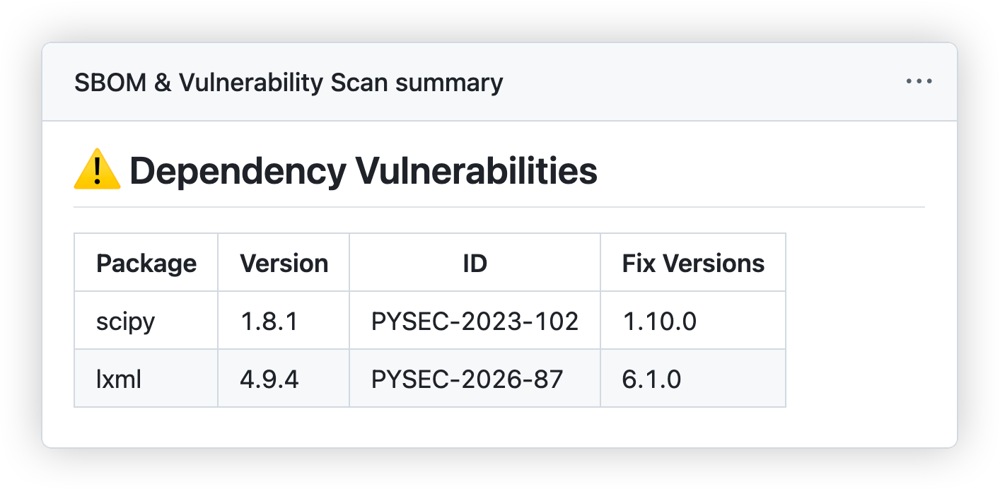

# Tutorial: Building a CI/CD Pipeline with GitHub Actions

## What you will build

A GitHub Actions pipeline that runs automatically on every push to `main` — but only when files outside `tests/` are changed. It will cover five stages: linting, automated tests, SBOM and vulnerability scanning, static security analysis, and publishing a binary.

Work through each step, push, and verify the pipeline turns green before moving on.

---

## Setup

GitHub Actions reads workflow files from `.github/workflows/`.  
Create `.github/workflows/pipeline.yml` and start with this skeleton — it already handles the trigger and path filter:

```yaml
name: CI/CD Pipeline

on:
  push:
    branches: [main]
    paths-ignore:
      - 'tests/**'

jobs:
  # your jobs go here
```

`paths-ignore` means the pipeline is skipped entirely when only test files changed.

Push this file. An entry should appear in the **Actions** tab (doing nothing yet — that's fine).

---

## Step 1 — Linting

**What & why:** A linter reads your code without running it and flags style violations and common mistakes. Running it in CI means bad style never silently enters the main branch.

**Tool:** [ruff](https://docs.astral.sh/ruff/) — a modern Python linter and formatter that is significantly faster than flake8 and covers the same rules. Install it with `pip install ruff` and run it with `ruff check .`.

**Your task:** Add a job named `lint` that:
1. checks out the code
2. sets up Python 3.10
3. installs and runs ruff

> The existing codebase uses star imports and long lines. You will need a small `ruff.toml` config file at the project root to keep the linter happy — check the ruff docs for `ignore` and `line-length`.

Push and verify the job is green.

---

## Step 2 — Automated Tests

**What & why:** Running the test suite in CI ensures that every pushed commit is verified against the full test suite, not just the developer's local machine.

**Tool:** [pytest](https://docs.pytest.org/) — already configured in `pytest.ini`.

**Your task:** Add a job named `test` that installs dependencies from `requirements.txt` and runs `pytest tests/ -v`. It should only start after `lint` has passed — use the `needs:` key.

> One CLI command in this project depends on **Graphviz**, a system-level binary not installable via pip. Without it, three tests are silently skipped. To run those too, install Graphviz with `apt-get` before the pip step.

Push and verify both `lint` and `test` are green.

---

## Step 3 — SBOM Generation

**What & why:** An SBOM (Software Bill of Materials) is a machine-readable inventory of every library your software depends on. It is a deliverable in itself — a consumer of your software can use it to audit what they are running. It also serves as input for vulnerability scanners (see Extension A).

**Tool:** [Syft](https://github.com/anchore/syft) — generates SBOMs in various formats. Install it via its install script and run with `syft . -o cyclonedx-json=sbom.json` to produce a CycloneDX JSON file.

**Your task:** Add a job named `sbom` that:
1. installs Syft and generates `sbom.json`
2. uploads `sbom.json` as a pipeline artifact
3. runs [pip-audit](https://pypi.org/project/pip-audit/) against `requirements.txt` as a quick Python-specific dependency scan

It should only start after `test` has passed.

> The dependencies in `requirements.txt` are pinned to 2022 versions and will have known [CVEs (Common Vulnerabilities and Exposures)](https://de.wikipedia.org/wiki/Common_Vulnerabilities_and_Exposures). The pip-audit scan should not block the pipeline — use `continue-on-error: true` so findings appear in the log without stopping the build. This makes for a great live discussion about dependency hygiene.

Push, open **Actions → your run → Artifacts**, and download the generated SBOM to inspect what it contains.

---

## Step 4 — Static Security Scan (SAST)

**What & why:** Unlike a vulnerability scanner (which checks your *dependencies*), a SAST tool reads *your own source code* and flags dangerous patterns — hard-coded secrets, use of unsafe functions, injection risks, and more.

**Tool:** [bandit](https://bandit.readthedocs.io/) — the de-facto Python SAST tool. Install it with `pip install bandit` and run it with `bandit -r . --exclude .venv,tests`.

**Your task:** Add a job named `security` that installs and runs bandit. Use a flag to set a minimum severity threshold so the job fails only on findings above a certain level. Like `sbom`, it should only start after `test` has passed.

Push and read the bandit output — it prints a readable summary of any findings.

> **Alternative:** [Semgrep](https://semgrep.dev/docs/semgrep-ci/sample-ci-configs/#github-actions) has a ready-made GitHub Action and supports many languages beyond Python.

---

## Step 5 — Build & Publish a Binary

**What & why:** The final stage packages the tool into a standalone executable that anyone can run without installing Python. This is the "ship it" step — it only runs once everything else has passed.

**Tool:** [PyInstaller](https://pyinstaller.org/en/stable/) — bundles a Python script and all its dependencies into a single binary. Install it with `pip install pyinstaller` and run it with `pyinstaller --onefile main.py --name optimizhelper`.

**Your task:** Add a job named `publish` that:
1. builds the binary
2. uploads it as a pipeline artifact named `optimizhelper-linux`
3. only starts **after** `lint`, `test`, `sbom`, and `security` have all passed — use the [`needs:`](https://docs.github.com/en/actions/writing-workflows/workflow-syntax-for-github-actions#jobsjob_idneeds) key for this

Push, then go to **Actions → your run → Artifacts** and download the binary. Try running it.

---

## Extension A — Scan the SBOM with Grype

After [Step 3](#step-3--sbom-generation) the SBOM exists as a downloadable artifact, but nothing in the pipeline actually reads it — it is generated and immediately shelved. This extension closes that gap.

The SBOM can be fed directly into a CVE scanner that checks every component against a live vulnerability database.

**Tool:** [Grype](https://github.com/anchore/grype) — a vulnerability scanner that accepts a Syft SBOM as direct input. Install it via its install script and scan with `grype sbom:sbom.json`. Always run `grype db update` first — Grype ships with a bundled CVE database and refuses to scan if it is more than 5 days old.

**Your task:** Add two steps to the `sbom` job (after the artifact upload):
1. install Grype via its install script
2. update the CVE database and scan `sbom.json`, using `--fail-on medium` to mark the step red on any medium-or-above finding — but keep `continue-on-error: true` so the pipeline still proceeds

---

## Extension B — Structured Vulnerability Reporting

The basic `pip-audit` step from [Step 3](#step-3--sbom-generation) prints findings to the log. GitHub Actions supports richer reporting:

- **Annotations** — `::warning::` lines printed to stdout appear as yellow flags on the job summary and file view.
- **Step summary** — writing markdown to `$GITHUB_STEP_SUMMARY` renders a formatted table directly on the run page. See example below:

- **Downloadable artifact** — uploading the raw JSON report lets stakeholders retrieve it outside the UI.

**Your task:** Replace the plain `pip-audit` run with a step that:
1. runs pip-audit with `-f json -o audit-report.json` to save results as JSON
2. parses the JSON with an inline Python script and prints `::warning::` for each vulnerability
3. writes a markdown table to `$GITHUB_STEP_SUMMARY`
4. uploads `audit-report.json` as an artifact using `actions/upload-artifact`

</br>
</br>
</br>
</br>
</br>
</br>
</br>
</br>
</br>

# 🚨🚨 SOLUTION BELOW 🚨🚨

</br>
</br>
</br>
</br>
</br>
</br>
</br>
</br>


## Possible Solutions

Stuck? Expand the section for the step you are on.

<details>
<summary><strong>Step 1 — Linting</strong></summary>

Add `ruff.toml` at the project root:

```toml
line-length = 120
exclude = [".venv", "tests"]

[lint]
ignore = ["E402", "F401", "F403", "F405"]
```

Job:

```yaml
  lint:
    name: Lint
    runs-on: ubuntu-latest
    steps:
      - uses: actions/checkout@v6
      - uses: actions/setup-python@v6
        with:
          python-version: '3.10'
      - run: pip install ruff
      - run: ruff check .
```

</details>

<details>
<summary><strong>Step 2 — Tests</strong></summary>

```yaml
  test:
    name: Test
    runs-on: ubuntu-latest
    needs: [lint]
    steps:
      - uses: actions/checkout@v6
      - uses: actions/setup-python@v6
        with:
          python-version: '3.10'
      - name: Install system dependencies
        run: sudo apt-get install -y graphviz
      - name: Install Python dependencies
        run: pip install -r requirements.txt pytest
      - name: Run test suite
        run: pytest tests/ -v
```

</details>

<details>
<summary><strong>Step 3 — SBOM Generation</strong></summary>

```yaml
  sbom:
    name: SBOM & Vulnerability Scan
    runs-on: ubuntu-latest
    needs: [test]
    steps:
      - uses: actions/checkout@v6

      - uses: actions/setup-python@v6
        with:
          python-version: '3.10'

      - name: Install Syft
        run: |
          curl -sSfL https://raw.githubusercontent.com/anchore/syft/main/install.sh | sh -s -- -b /usr/local/bin

      - name: Generate SBOM
        run: syft . -o cyclonedx-json=sbom.json

      - name: Upload SBOM as artifact
        uses: actions/upload-artifact@v7
        with:
          name: sbom
          path: sbom.json

      - name: Scan dependencies for vulnerabilities
        run: |
          pip install pip-audit
          pip-audit -r requirements.txt
        continue-on-error: true
```

</details>

<details>
<summary><strong>Step 4 — Static Security Scan</strong></summary>

```yaml
  security:
    name: Static Security Scan
    runs-on: ubuntu-latest
    needs: [test]
    steps:
      - uses: actions/checkout@v6
      - uses: actions/setup-python@v6
        with:
          python-version: '3.10'
      - run: pip install bandit
      - name: Run bandit
        run: bandit -r . --exclude .venv,tests -ll
```

`-ll` reports medium severity and above. Use `-l` to also include low-severity findings.

</details>

<details>
<summary><strong>Step 5 — Build & Publish</strong></summary>

```yaml
  publish:
    name: Build & Publish Binary
    runs-on: ubuntu-latest
    needs: [lint, test, sbom, security]
    steps:
      - uses: actions/checkout@v6
      - uses: actions/setup-python@v6
        with:
          python-version: '3.10'
      - name: Install dependencies
        run: pip install -r requirements.txt pyinstaller
      - name: Build standalone binary
        run: pyinstaller --onefile main.py --name optimizhelper
      - name: Upload binary as artifact
        uses: actions/upload-artifact@v7
        with:
          name: optimizhelper-linux
          path: dist/optimizhelper
```

</details>

<details>
<summary><strong>Extension A — Scan the SBOM with Grype</strong></summary>

Add these two steps to the `sbom` job, after the artifact upload and before pip-audit:

```yaml
      - name: Install Grype
        run: |
          curl -sSfL https://raw.githubusercontent.com/anchore/grype/main/install.sh | sh -s -- -b /usr/local/bin

      - name: Scan SBOM for vulnerabilities
        run: |
          grype db update
          grype sbom:sbom.json --fail-on medium
        continue-on-error: true
```

`grype db update` ensures the CVE database is fresh — without it, Grype refuses to scan if its bundled database is older than 5 days. `--fail-on medium` marks the step red when medium-or-above CVEs are found; `continue-on-error: true` keeps the pipeline running regardless so findings are visible without blocking delivery.

</details>

<details>
<summary><strong>Extension B — Structured Vulnerability Reporting</strong></summary>

Replace the plain `pip-audit` step with this:

```yaml
      - name: Scan dependencies for vulnerabilities
        run: |
          pip install pip-audit
          pip-audit -r requirements.txt -f json -o audit-report.json || true
          python3 - <<'EOF'
          import json, os
          with open('audit-report.json') as f:
              data = json.load(f)
          vulns = [
              (d['name'], d['version'], v['id'], ', '.join(v.get('fix_versions', [])) or 'none')
              for d in data.get('dependencies', [])
              for v in d.get('vulns', [])
          ]
          if vulns:
              for name, ver, vid, fixes in vulns:
                  print(f'::warning::{name}=={ver} · {vid} · fix: {fixes}')
              with open(os.environ['GITHUB_STEP_SUMMARY'], 'a') as f:
                  f.write('## ⚠️ Dependency Vulnerabilities\n\n')
                  f.write('| Package | Version | ID | Fix Versions |\n')
                  f.write('|---|---|---|---|\n')
                  for name, ver, vid, fixes in vulns:
                      f.write(f'| {name} | {ver} | {vid} | {fixes} |\n')
          else:
              print('No known vulnerabilities found.')
          EOF
        continue-on-error: true

      - name: Upload vulnerability report
        if: always()
        uses: actions/upload-artifact@v7
        with:
          name: vulnerability-report
          path: audit-report.json
```

`-f json -o audit-report.json` saves machine-readable output instead of printing to the console. The inline Python script reads it, emits `::warning::` annotations (visible as yellow flags in the GitHub UI), and writes a formatted table to the job summary page. `|| true` prevents a non-zero exit from pip-audit reaching the Python parser before it runs. `if: always()` on the upload ensures the artifact is saved even when the scan step exits with warnings.

</details>

<details>
<summary><strong>Complete <code>pipeline.yml</code> (Steps 1–5 + Extensions A & B)</strong></summary>

```yaml
name: CI/CD Pipeline

on:
  push:
    branches: [main]
    paths-ignore:
      - 'tests/**'

jobs:

  lint:
    name: Lint
    runs-on: ubuntu-latest
    steps:
      - uses: actions/checkout@v6
      - uses: actions/setup-python@v6
        with:
          python-version: '3.10'
      - run: pip install -r requirements.txt
      - run: ruff check .

  test:
    name: Test
    runs-on: ubuntu-latest
    needs: [lint]
    steps:
      - uses: actions/checkout@v6
      - uses: actions/setup-python@v6
        with:
          python-version: '3.10'
      - name: Install system dependencies
        run: sudo apt-get install -y graphviz
      - name: Install Python dependencies
        run: pip install -r requirements.txt pytest
      - name: Run test suite
        run: pytest tests/ -v

  sbom:
    name: SBOM & Vulnerability Scan
    runs-on: ubuntu-latest
    needs: [test]
    steps:
      - uses: actions/checkout@v6

      - uses: actions/setup-python@v6
        with:
          python-version: '3.10'

      - name: Install Syft
        run: |
          curl -sSfL https://raw.githubusercontent.com/anchore/syft/main/install.sh | sh -s -- -b /usr/local/bin

      - name: Generate SBOM
        run: syft . -o cyclonedx-json=sbom.json

      - name: Upload SBOM as artifact
        uses: actions/upload-artifact@v7
        with:
          name: sbom
          path: sbom.json

      - name: Install Grype
        run: |
          curl -sSfL https://raw.githubusercontent.com/anchore/grype/main/install.sh | sh -s -- -b /usr/local/bin

      - name: Scan SBOM for vulnerabilities
        run: |
          grype db update
          grype sbom:sbom.json --fail-on medium
        continue-on-error: true

      - name: Scan dependencies for vulnerabilities
        run: |
          pip install pip-audit
          pip-audit -r requirements.txt -f json -o audit-report.json || true
          python3 - <<'EOF'
          import json, os
          with open('audit-report.json') as f:
              data = json.load(f)
          vulns = [
              (d['name'], d['version'], v['id'], ', '.join(v.get('fix_versions', [])) or 'none')
              for d in data.get('dependencies', [])
              for v in d.get('vulns', [])
          ]
          if vulns:
              for name, ver, vid, fixes in vulns:
                  print(f'::warning::{name}=={ver} · {vid} · fix: {fixes}')
              with open(os.environ['GITHUB_STEP_SUMMARY'], 'a') as f:
                  f.write('## ⚠️ Dependency Vulnerabilities\n\n')
                  f.write('| Package | Version | ID | Fix Versions |\n')
                  f.write('|---|---|---|---|\n')
                  for name, ver, vid, fixes in vulns:
                      f.write(f'| {name} | {ver} | {vid} | {fixes} |\n')
          else:
              print('No known vulnerabilities found.')
          EOF
        continue-on-error: true

      - name: Upload vulnerability report
        if: always()
        uses: actions/upload-artifact@v7
        with:
          name: vulnerability-report
          path: audit-report.json

  security:
    name: Static Security Scan
    runs-on: ubuntu-latest
    needs: [test]
    steps:
      - uses: actions/checkout@v6
      - uses: actions/setup-python@v6
        with:
          python-version: '3.10'
      - run: pip install bandit
      - name: Run bandit
        run: bandit -r . --exclude .venv,tests -ll

  publish:
    name: Build & Publish Binary
    runs-on: ubuntu-latest
    needs: [lint, test, sbom, security]
    steps:
      - uses: actions/checkout@v6
      - uses: actions/setup-python@v6
        with:
          python-version: '3.10'
      - name: Install dependencies
        run: pip install -r requirements.txt pyinstaller
      - name: Build standalone binary
        run: pyinstaller --onefile main.py --name optimizhelper
      - name: Upload binary as artifact
        uses: actions/upload-artifact@v7
        with:
          name: optimizhelper-linux
          path: dist/optimizhelper
```

</details>
